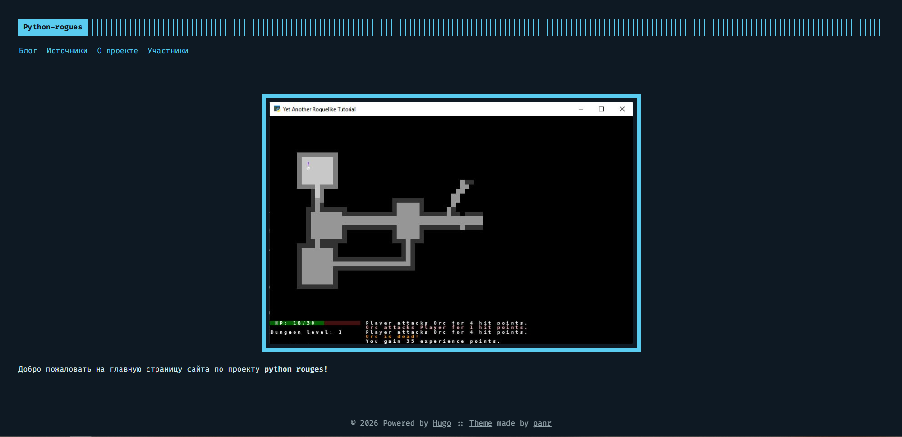

# Веб-страница проекта


**Автор: Головко Макар ([sibin57](https://github.com/sibin57))**


В данной папке хранится исходный код статичной веб-страницы проекта

## Запуск страницы

Чтобы просмотреть страницу, есть два варианта:
* перейдите по ссылке на уже готовую страницу: <https://bbbeeerrrrr.github.io/python-rogues/>
* самостоятельно поднять сервер hugo (описано далее)

Для запуска веб-сервера необходим Hugo **Extended** v0.90.x.

Перед тем, как запускать сервер, в файле `hugo.toml` измените baseurl на /
```yaml
#было
baseurl = "/python-rogues/" #для pages
#стало
baseurl = "/" #для локального пользования
```

Для запуска сервера перейдите в папку `site`, и выполните команду 

```bash
$ hugo server
```
затем  перейдите по адресу, который вам напишет программа (*по умолчанию localhost:1313*)

или же можно запуститься из корня проекта командой

```bash
$ hugo server -s .\site\
```

## Структура сайта

Структура сайта выглядит следующим образом

- [главная страница](https://bbbeeerrrrr.github.io/python-rogues/)
	+ ["о проекте"](https://bbbeeerrrrr.github.io/python-rogues//about/) 
	+ [участники и их вклад](https://bbbeeerrrrr.github.io/python-rogues/contributors/)
	+ [блог о ходе разработки](https://bbbeeerrrrr.github.io/python-rogues//posts/)
	+ [ресурсы (ссылки на источники)](https://bbbeeerrrrr.github.io/python-rogues/links/)

# Использованные источники
Для создания страницы использовался генератор статичных веб-страниц [hugo](https://gohugo.io) и визуальная тема [terminal](https://github.com/panr/hugo-theme-terminal)
